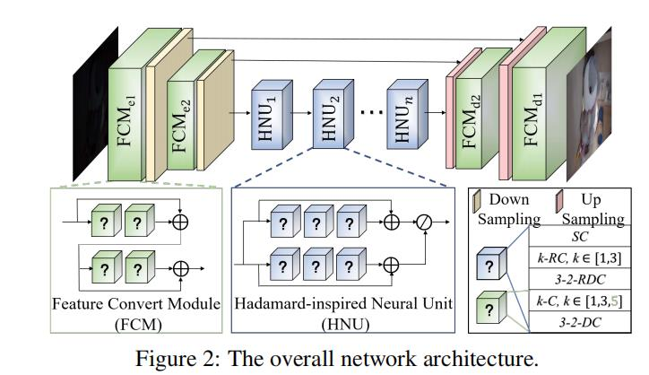
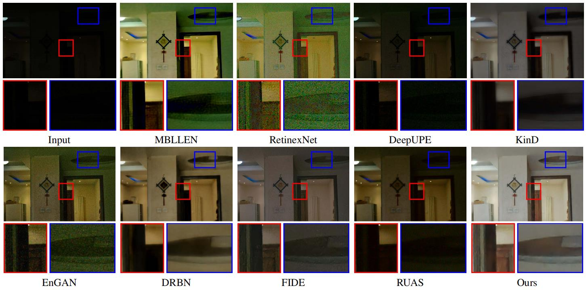
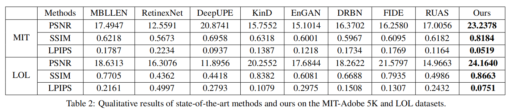

# HBLALS
This is the official code for the paper "Hierarchical-Bilevel-Learning-with-Architecture-and-Loss-Search-for-Hadamard-based-Image-Restoration" (Coming Soon)






# Train
To search loss, you can run ```python train_search_loss.py```

To search architecture, you can run ```python train_search_architecture.py```

To train the model, you can run ```python train.py```
# Pretrained models
To evaluate our trained models, run ```python test.py```

The pretrained models are coming soon!

# Reference
If you find this code useful, please cite:

@inproceedings{Zhu22,
author = {Guijing Zhu and Long Ma and Risheng Liu and Xin Fan},
title = {Hierarchical Bilevel Learning with Architecture and Loss Search for Hadamard-based Image Restoration},
booktitle = {Proceedings of International Joint Conference on Artificial Intelligence, {IJCAI} 2022},
year = {2022},
}
